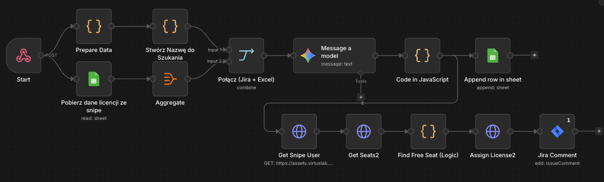

# Automated License Assignment from Jira

> n8n workflow that automatically assigns software licenses in Snipe-IT when a Jira ticket is submitted, using AI to match the requested system to the correct license


---

## Workflow Preview



---

## Problem

When an employee requests access to a software tool via Jira, someone has to manually look up the correct license in Snipe-IT, find a free seat, and assign it. With dozens of tools and multiple license variants per tool (Pro, Ultimate, Community, per-org), manual matching is slow and error-prone.

**~5 minutes of manual work per request. Scales poorly with org size.**

---

## Solution

A Jira automation triggers an n8n webhook when a ticket reaches the right status. The workflow parses the requested systems, uses Gemini AI to fuzzy-match the request to the correct Snipe-IT license, finds a free seat, assigns it to the user, and logs the action — all without human intervention.

```
Jira Automation (webhook trigger)
        │
        ▼
   ┌────┴────────────────┐
   │                     │
Prepare Data      Get License Data
(parse request)   (Snipe-IT sheet)
   │                     │
   ▼                     ▼
Build Search Key     Aggregate
   │                     │
   └──────────┬──────────┘
              ▼
        Merge Data
              │
              ▼
    Match License with AI (Gemini)
              │
        ┌─────┴─────┐
        ▼           ▼
  Log to Sheet   Get Snipe User
                     │
                     ▼
              Get License Seats
                     │
                     ▼
            Find Free Seat (Logic)
                     │
                     ▼
            Assign License (API)
                     │
                     ▼
            Add Jira Comment
```

---

## Workflow Steps

### 1. Start (Webhook Trigger)
- Receives POST request from Jira automation
- Payload contains: issue key, reporter email, requested system list, permission level

### 2. Prepare Data (JavaScript)
- Parses the system list from the Jira ticket (supports array, comma-separated string, or "other" field)
- Resolves "on behalf of" email if the request is submitted for another user
- Extracts system-specific details (e.g. org name for multi-org tools like GitHub or Figma)
- Outputs one item per requested system — supports bulk requests

### 3. Get License Data from Snipe-IT
- Reads the current license export from Google Sheets (regularly updated Snipe-IT export)
- Filters by company to handle multi-entity environments

### 4. Build Search Key
- Combines system name + detail + permission level into a single search string
- Example: `"GitHub VirtusLab-RnD User"` → passed to AI for matching

### 5. Aggregate + Merge
- Aggregates all license rows into a single item
- Merges with the Jira request data for AI processing

### 6. Match License with AI (Gemini)
- Sends search key + full license database to Gemini
- AI scans 100% of the license list and returns the best match
- Handles variants: Pro vs Community, per-org licenses, product suites
- Returns: `matched_license_name` + `license_id`

### 7. Parse AI Response (JavaScript)
- Cleans Markdown formatting from AI output
- Validates response is a proper JSON object
- Gracefully handles parse errors and unexpected formats
- Combines AI result with original Jira request data

### 8. Log to Sheet
- Appends the assignment record to a Google Sheet log
- Columns: Issue Key, User Email, Requested System, Matched License, License ID, Date

### 9. Get Snipe User
- Queries Snipe-IT API by email to retrieve the user's internal ID

### 10. Get License Seats
- Fetches all seats for the matched license (up to 200)

### 11. Find Free Seat (Logic)
- Finds a seat where `checkout: true` or `assigned_user: null`
- Throws a descriptive error if all seats are occupied
- Builds a Jira ticket URL as the assignment note for audit trail

### 12. Assign License (API)
- PUT request to Snipe-IT API: assigns the free seat to the user
- Includes Jira issue URL as the note

### 13. Jira Comment
- Adds a comment to the Jira ticket confirming license assignment

---

## Edge Cases Handled

| Case | Handling |
|---|---|
| Multi-org tools (e.g. GitHub, Figma) | `system_details` field passes org context to AI |
| Tool suites with variants (e.g. Jira products) | AI instructed to check variants and pick exact match |
| "Other" system field | Falls back to `otherSystemName` field |
| Request on behalf of another user | `onBehalfEmail` field override |
| All seats occupied | Throws descriptive error with license ID and seat count |
| Missing user ID or license ID | Validation before assignment with clear error message |
| AI returns non-JSON response | Markdown stripping + parse error handler |
| AI returns array or null instead of object | Type guard with fallback object |

---

## Stack

| | |
|---|---|
| Automation | n8n |
| Trigger | Webhook (Jira Automation → n8n) |
| License source | Google Sheets (Snipe-IT export) |
| AI matching | Google Gemini 2.0 Flash Lite |
| Asset management | Snipe-IT (REST API) |
| Issue tracker | Jira Software Cloud |
| Logging | Google Sheets |
| Environment | n8n SaaS or self-hosted |

---

## Setup

1. Import `workflow.json` into your n8n instance
2. Configure credentials:
   - Google Sheets OAuth2
   - Google Gemini (PaLM) API
   - Snipe-IT API (HTTP Header Auth)
   - Jira Software Cloud API
3. Update placeholders in the workflow:
   - `[YOUR_SNIPE_IT_URL]` — your Snipe-IT instance URL
   - `[YOUR_JIRA_URL]` — your Jira instance URL
   - `[YOUR_GOOGLE_SHEET_ID]` — Google Sheet ID with Snipe-IT license export
   - `[YOUR_LOG_SHEET_ID]` — Google Sheet ID for assignment log
   - `[YOUR_COMPANY_NAME]` — company name filter for multi-entity Snipe-IT
4. In Jira: create an automation rule that POSTs to the n8n webhook URL when a ticket reaches the trigger status
5. Adjust the `Prepare Data` node's field extraction to match your Jira ticket structure

---

## My Role

**Author and sole developer.**

I identified the manual bottleneck in the license assignment process, designed the dual-path architecture (request parsing + license database fetch running in parallel), chose AI-based fuzzy matching to handle the real-world complexity of license naming inconsistencies, implemented the seat-finding logic and audit trail, and deployed this to production.

The hardest part was handling edge cases: tools with multiple organizations, product suites with variants, and the AI occasionally returning malformed JSON — all handled in the Parse AI Response node.
