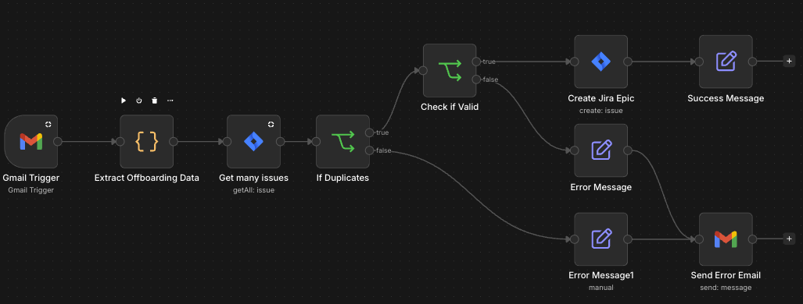

# Automated Jira Ticket Creation from Offboarding Emails

> n8n workflow that automatically creates offboarding Jira Epics when HR notifies about an employee departure


---

## Workflow Preview



---

## Problem

Every departing employee requires a set of offboarding tickets in Jira — access revocation, equipment return, knowledge transfer, and more. Without automation, this means manually reading the HR notification email, extracting employee data, and creating the Epic by hand.

**Risk: offboarding tickets get missed or created late, leaving active access for employees who have already left. ~5 minutes of manual work per departure.**

---

## Solution

When an HR email about a departing employee arrives, the workflow automatically parses the structured data from the email body, checks for duplicates, validates required fields, and creates a Jira Epic with all relevant offboarding details pre-filled.

```
Gmail Trigger (every 15 min)
        │
        ▼
Extract Offboarding Data (JS)
        │
        ▼
Check for Duplicate in Jira (last 7 days)
        │
   ┌────┴────┐
  No dup   Dup found
   │           │
   ▼           ▼
Validate    Log error +
required    send email
fields      notification
   │
 ┌─┴─┐
Valid Invalid
 │      │
 ▼      ▼
Create  Log error +
Jira    send email
Epic    notification
 │
 ▼
Success Message
```

**Result: zero manual data entry for offboarding ticket creation. ~5 min saved per departure.**

---

## Workflow Steps

### 1. Gmail Trigger
- Polls every **15 minutes**
- Filters: subject contains `Offboarding`, excludes replies/forwards (`-subject:Re:`, `-subject:Fwd:`, `-subject:AW:`, `-subject:Odp:`)
- Time window: `newer_than:1d` — prevents processing old emails

### 2. Extract Offboarding Data (JavaScript)
- Parses HTML table from the email body using a "guillotine" function — cuts values between known field labels
- Extracts: Full Name, Last Working Day, Contract End Date, Team, Location (configurable — add your own fields)
- Normalizes date to `YYYY-MM-DD` format for Jira API compatibility
- Falls back to today's date if no date is found — prevents hard failures

### 3. Duplicate Check
- Queries Jira for existing tickets matching the employee's full name created in the **last 7 days**
- Prevents double-processing if the workflow runs multiple times on the same email

### 4. IF — Duplicate Gate
- **TRUE** (no duplicate): proceed to validation
- **FALSE** (duplicate found): log error → send notification email

### 5. Data Validation
Checks mandatory fields:
- Full Name
- Last Working Day (must be parseable as a date)

### 6. IF — Validation Gate
- **TRUE** (valid data): create Jira Epic
- **FALSE** (missing data): log error → send notification email to admin

### 7. Create Jira Epic
Creates an Epic with:
- Summary: `[LAST_WORKING_DAY] | OFFBOARDING | [FULL_NAME]`
- Description: all extracted employee fields
- Custom fields: Leave date + any additional fields configured in your Jira project
- Reporter: workflow owner

### 8. Success Message
- Sets status and Epic key for downstream use or logging

---

## Edge Cases Handled

| Case | Handling |
|---|---|
| Email reply or forward | Filtered out at trigger level |
| Duplicate offboarding notification | Jira query check — skipped with error log |
| Old emails in inbox | `newer_than:1d` filter blocks stale emails |
| Missing required fields | Validation node catches it, admin notified via email |
| Non-standard date formats | Regex normalization (`DD.MM.YYYY`, `DD/MM/YYYY`, `DD-MM-YYYY`) |
| No date found in email | Falls back to today's date to prevent hard failure |

---

## Stack

| | |
|---|---|
| Automation | n8n |
| Trigger | Gmail (OAuth2, polling) |
| Data extraction | JavaScript (Code node) |
| Issue tracker | Jira Software Cloud |
| Error handling | Gmail (error notifications) |
| Environment | Docker (self-hosted) or n8n SaaS |

---

## Setup

1. Import `workflow.json` into your n8n instance
2. Configure credentials:
   - Gmail OAuth2 account
   - Jira Software Cloud API account
3. Update placeholders in the workflow:
   - `[YOUR_PROJECT]` / `[YOUR_PROJECT_ID]` — your Jira project key and ID
   - `[your-email]` — email address for error notifications
   - `[your-jira-user-id]` — your Jira account ID (reporter field)
   - `[custom-field-leave-date]` — your Jira custom field ID for leave date
4. Adjust email filter subject keyword to match your HR notification format
5. Adjust field labels in the JS extraction node to match your HR email table structure

---

## My Role

**Author and sole developer.**

I identified the operational gap, designed the workflow logic including the two-stage validation (duplicate check + field validation), implemented the JavaScript HTML parsing, handled edge cases based on real production scenarios, and deployed this to production.

> **Related:** See also [automatic-tasks-ONB](../automatic-tasks-ONB) — the onboarding counterpart to this workflow.
