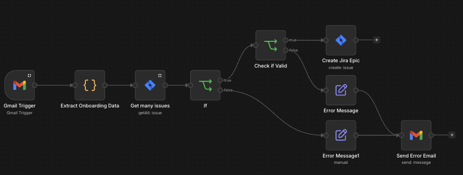

# Automated Jira Ticket Creation from HR Emails

> n8n workflow that automatically creates onboarding Jira Epics when HR notifies about a new hire


---

## Workflow Preview


<!-- Add more screenshots below if needed -->
<!--  -->

---

## Problem

Every new hire requires a set of onboarding tickets to be created in Jira. Without automation, this means someone has to manually read the HR notification email, extract employee data, and create the Epic by hand.

**Risk: tickets get missed or created late, delaying the onboarding process. ~5 minutes of manual work per employee.**

---

## Solution

When an HR email about a new employee arrives, the workflow automatically parses the structured data from the email body, checks for duplicates, validates required fields, and creates a Jira Epic with all relevant employee details pre-filled.

```
Gmail Trigger (every 15 min)
        │
        ▼
Extract Onboarding Data (JS)
        │
        ▼
Check for Duplicate in Jira (last 7 days)
        │
   ┌────┴────┐
  No dup   Dup found
   │           │
   ▼           ▼
Validate    Log error +
required    send email
fields      notification
   │
 ┌─┴─┐
Valid Invalid
 │      │
 ▼      ▼
Create  Log error +
Jira    send email
Epic    notification
```

**Result: zero manual data entry for onboarding ticket creation. ~5 min saved per new hire.**

---

## Workflow Steps

### 1. Gmail Trigger
- Polls every **15 minutes**
- Filters: subject contains trigger keyword, excludes replies/forwards (`-subject:Re:`, `-subject:Fwd:`, `-subject:AW:`, `-subject:Odp:`), excludes contractor emails
- Time window: `newer_than:1d` — prevents processing old emails

### 2. Extract Onboarding Data (JavaScript)
- Parses HTML table from the email body using a "guillotine" function — cuts values between known field labels
- Normalizes Polish diacritics from HTML entities
- Extracts: Full Name, Start Date, Position, Team, Location (configurable — add your own fields)
- Normalizes date to `YYYY-MM-DD` format for Jira API compatibility

### 3. Duplicate Check
- Queries Jira for existing tickets matching the employee's full name created in the **last 7 days**
- Prevents double-processing if the workflow runs multiple times on the same email

### 4. IF — Duplicate Gate
- **TRUE** (no duplicate): proceed to validation
- **FALSE** (duplicate found): log error → send notification email

### 5. Data Validation
Checks mandatory fields:
- Full Name
- Start Date (must be parseable as a date)

### 6. IF — Validation Gate
- **TRUE** (valid data): create Jira Epic
- **FALSE** (missing data): log error → send notification email to admin

### 7. Create Jira Epic
Creates an Epic with:
- Summary: `[START_DATE] | ONBOARDING | [FULL_NAME]`
- Description: all extracted employee fields
- Custom fields: Start date + any additional fields configured in your Jira project
- Reporter: workflow owner

---

## Edge Cases Handled

| Case | Handling |
|---|---|
| Email reply or forward | Filtered out at trigger level |
| Duplicate hire notification | Jira query check — skipped with error log |
| Old emails in inbox | `newer_than:1d` filter blocks stale emails |
| Missing required fields | Validation node catches it, admin notified via email |
| Non-standard date formats | Regex normalization (`DD.MM.YYYY`, `DD/MM/YYYY`, `DD-MM-YYYY`) |

---

## Stack

| | |
|---|---|
| Automation | n8n |
| Trigger | Gmail (OAuth2, polling) |
| Data extraction | JavaScript (Code node) |
| Issue tracker | Jira Software Cloud |
| Error handling | Gmail (error notifications) |
| Environment | Docker (self-hosted) or n8n SaaS |

---

## Setup

1. Import `workflow.json` into your n8n instance
2. Configure credentials:
   - Gmail OAuth2 account
   - Jira Software Cloud API account
3. Update placeholders in the workflow:
   - `[YOUR_PROJECT]` / `[YOUR_PROJECT_ID]` — your Jira project key and ID
   - `[your-email]` — email address for error notifications
   - `[your-jira-user-id]` — your Jira account ID (reporter field)
4. Adjust email filter subject keyword to match your HR notification format
5. Adjust field labels in the JS extraction node to match your HR email table structure

---

## My Role

**Author and sole developer.**

I identified the operational gap, designed the workflow logic including the two-stage validation (duplicate check + field validation), implemented the JavaScript HTML parsing, handled edge cases based on real production scenarios, and deployed this to production.
